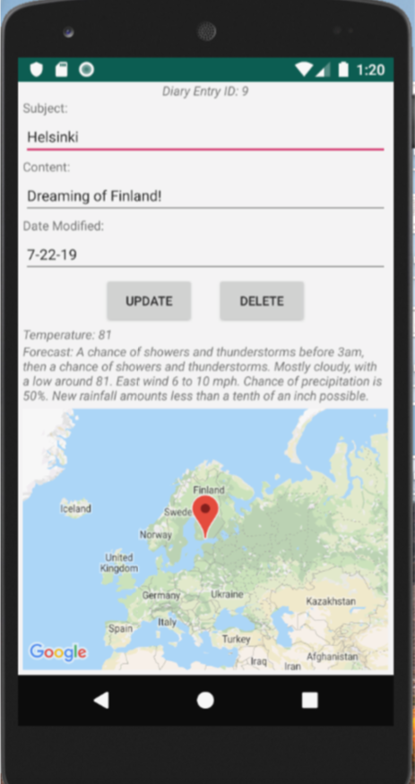

# AndroidDiaryApp
This is an Android Studio diary app which utilizes web services, location, google mapping, storage with SQLite, and basic password security using shared preferences. In order for this app to run correctly, you need to enter a Google Maps API key in the resources xml file (google_maps_api.xml). 

* Example Diary Entry

